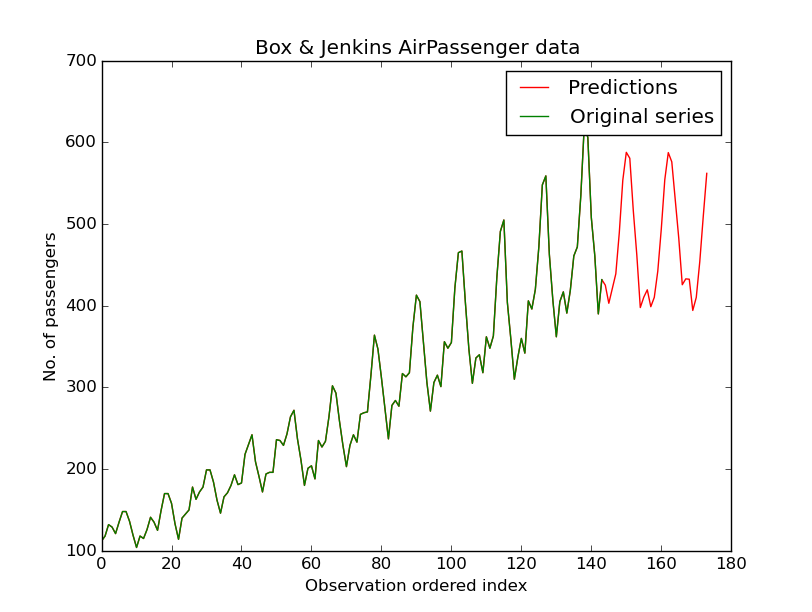

# nnet-ts
Neural network architecture for time series forecasting.

## Requirements and installation
This packages relies heavily on `numpy`, `scipy`, `pandas`, `theano` and `keras`. Check on their repositories how to install them first.

Then, simply fetch the package from PyPI.

````
sudo pip install nnet-ts
````

## Usage 

Using Box & Jenkins classical air passenger data.

````python
from nnet_ts import *

time_series = np.array(pd.read_csv("AirPassengers.csv")["x"])
````

Create a `TimeSeriesNnet` object and specify each layer size and activation function.

````python
neural_net = TimeSeriesNnet(hidden_layers = [20, 15, 5], activation_functions = ['sigmoid', 'sigmoid', 'sigmoid'])
````

Then just fit the data and predict values:

````python
neural_net.fit(time_series, lag = 40, epochs = 10000)
neural_net.predict_ahead(n_ahead = 30)
````

Did we get it right? Let's check

````python
import matplotlib.pyplot as plt
plt.plot(range(len(neural_net.timeseries)), neural_net.timeseries, '-r', label='Predictions', linewidth=1)
plt.plot(range(len(time_series)), time_series, '-g',  label='Original series')
plt.title("Box & Jenkins AirPassenger data")
plt.xlabel("Observation ordered index")
plt.ylabel("No. of passengers")
plt.legend()
plt.show()
````




